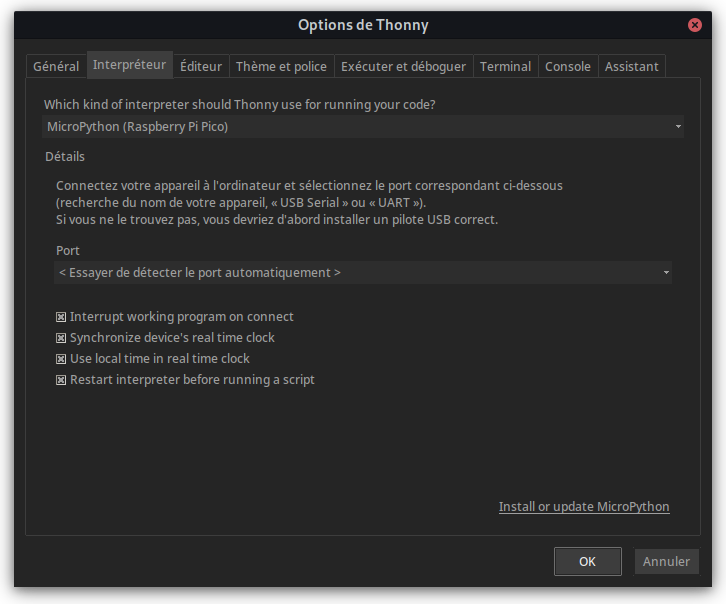
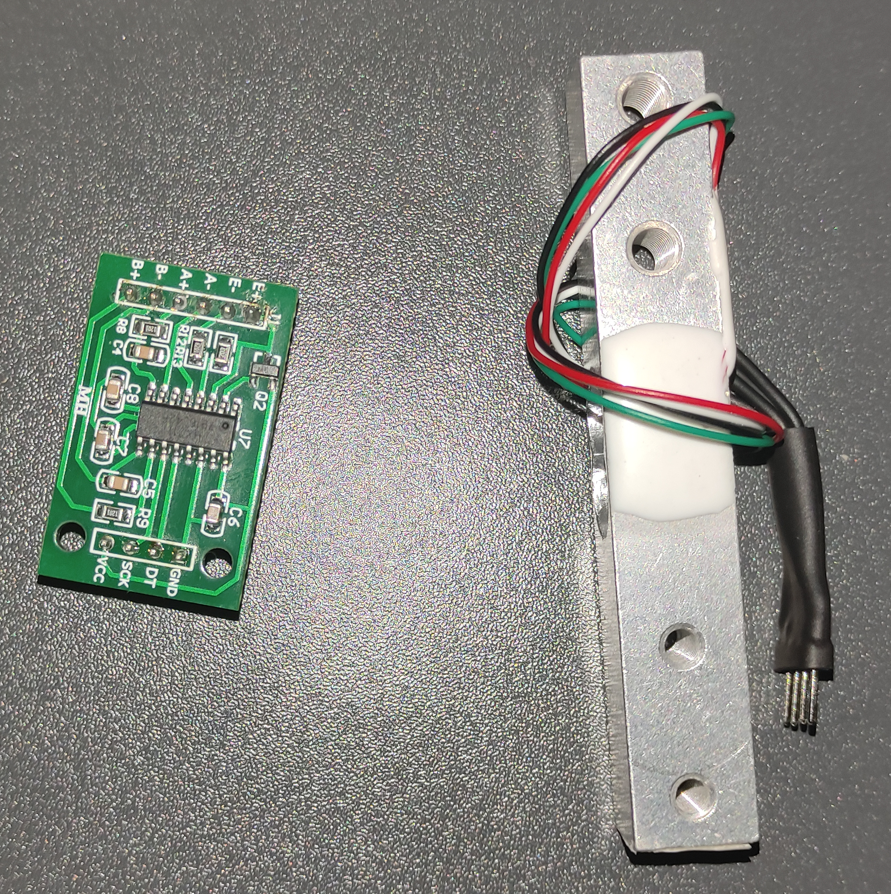
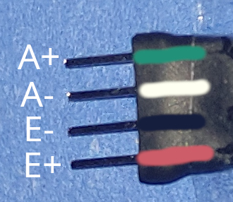
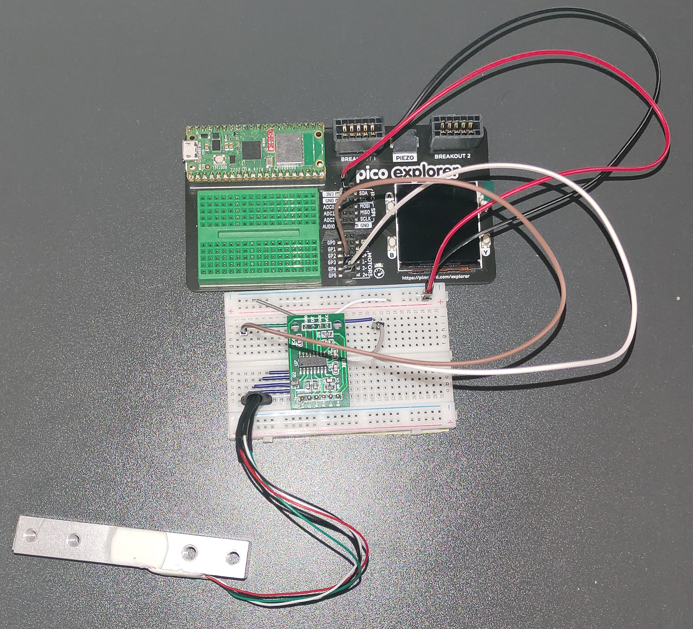

# PoC 1 : Récupérer les données d'un module et l'afficher sur un écran

L'objectif est de connecter une balance à un [Raspberry Pi Pico](./glossaire.md#rapsberry-pi-pico) connectée sur un [Pico Explorer](./glossaire.md#pico-explorer) et d'en afficher la valeur convertie en grammes sur l'écran de l'Eplorer.

## Installer MicroPython sur le RPi Pico
Avant de pouvouir coder sur la carte, il faut installer le firmware. Normalement on utiliserait le [firmware officiel](https://micropython.org/download/rp2-pico-w/rp2-pico-w-latest.uf2), mais vu qu'on utilise un Pico Explorer, on dit à la place utiliser [celuis de Pimoroni](https://github.com/pimoroni/pimoroni-pico/releases/tag/v1.19.14).

Pour installer le firmware sur la carte, il faut la brancher à un ordinateur en appuyant sur le bouton BOOTSEL. Le microcontrôleur apparaîtera en tant que clé USB. Il suffit de copier le firmware sur la carte, elle va automatiquement s'éjècter.

Il faut maintenant mettre en place un Environnement de Développement Intégré (Integrated Developement Environement ou IDE en anglais), pour ce projet, [Thonny](https://thonny.org/). Après l'avoir installé, il faut le connécter au Pico. Pour cela, cliquer sur **Exécuter -> Configurer l'interpréteur**. Dans la première liste séléctionner **MicroPython (Raspberry Pi Pico)** et dans la deuxième soit **< Essayer de détecter le port automatiquement >** ou le bon port si ça échoue.


## Connécter la balance au microcontrôleur
La balance utilisée (HX711) est composée de deux parties, la cellule (la partie qui messure la pression appliquée) et un amplificateur.

La cellule est connectée à l'amplificateur de cette manière:


Tandit que le pour relier l'amp au Pico, il faut relier le VCC au 3.3V, GND ensemble et DT et SCK dans des PIN qui peuvent servir d'input. Le circuit final resemble à ça:



## Récupérer la valeur du microcontrôleur
Maintenant que la balance est connéctée, il faut récupérer ce qu'elle reçoit. Il y a deux manières, créer le code pour gérer l'amplificateur à la main ou aller chercher une librairie déjà faite. J'ai choisi la deuxième option car tout les tutoriel, quel que soit la carte, dit de procéder ainsi, et je leur donne raison car il s'agit un simple PoC, donc c'est inutile de passer trop de temps dessus.

D'abord, il faut crée une instance de la classe HX711 avec les PINs du DT, du SCK et le cannaux à utiliser.
```python
from hx711 import HX711 # from https://github.com/SergeyPiskunov/micropython-hx711
scale = HX711(PIN_DT, PIN_SCK, HX711.CHANNEL_A_64)
```
Puis dans une boule `while` infinie on lit la valeur de la balance et l'on l'affiche.
```python
while True:
    # Show scale value
    print(scale.read(True))
```
Ça nous affiche la valeur brut. Pour avoir une valeur en grammes par exemple, il faut garder la valeur de la balance en mémoire pour faire le tare. Je la fait lorsqu'on démarre le script et lorsqu'on appuye sur un bouton. Ensuite pour faire la conversion, j'ai regarder sur des tutoriels en ligne et la valeur **0.035274** revient souvent pour convertir en grammes.
```python title="Le code modifié"
while True:
    # Tare when the button is pressed
    if button.read():
        tare = scale.read(True)
    
    # Show scale value
    print(round((scale.read(True) - tare) * UNIT_MULT, 2))
```

## Afficher la valeur sur l'écran
Pour gérer l'écran de l'Explorer, on doit importer la librairie `picographics` ou les classes et valeur pertinentes.
```python
from picographics import PicoGraphics, DISPLAY_PICO_EXPLORER, PEN_RGB565, PEN_1BIT

# Initialise screen and pens
screen = PicoGraphics(display=DISPLAY_PICO_EXPLORER, pen_type=PEN_RGB565)
BLACK = screen.create_pen(0, 0, 0)
WHITE = screen.create_pen(255, 255, 255)
```

Puis dans la boucle récupérer la valeur et l'afficher.
```python
while True:
    # Tare when the button is pressed
    if button.read():
        tare = scale.read(True)
        
    # Clear the screen
    screen.set_pen(BLACK)
    screen.clear()
    
    value = round((scale.read(True) - tare) * UNIT_MULT, 2)
    
    # Show the scale's value
    screen.set_pen(WHITE)
    screen.text(f'{value} [{UNIT}]', 10, 10, scale=2)
    
    screen.update()
```