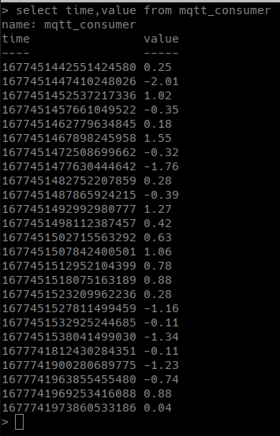

# PoC 3: Récupérer des données MQTT et les insérer dans une base de données InfluxDB

# Installation d'InfluxDB
La version utilisée est la 1.8. J'ai suivi le [tutoriel officiel](https://docs.influxdata.com/influxdb/v1.8/introduction/install/)

```bash title="Les commandes pour installer et lancer InfluxDB"
wget -q https://repos.influxdata.com/influxdata-archive_compat.key
echo '393e8779c89ac8d958f81f942f9ad7fb82a25e133faddaf92e15b16e6ac9ce4c influxdata-archive_compat.key' | sha256sum -c && cat influxdata-archive_compat.key | gpg --dearmor | sudo tee /etc/apt/trusted.gpg.d/influxdata-archive_compat.gpg > /dev/null
echo 'deb [signed-by=/etc/apt/trusted.gpg.d/influxdata-archive_compat.gpg] https://repos.influxdata.com/debian stable main' | sudo tee /etc/apt/sources.list.d/influxdata.list

sudo apt-get update && sudo apt-get install influxdb
sudo systemctl unmask influxdb.service
sudo systemctl start influxdb
```

InfluxDB est installé, mais tout le monde peut y accéder. Pour empécher ça, on crée un utilisateur et on modifie le fichier de configuration pour demander un nom d'utilisateur et mot de passe

```
CREATE USER pocs WITH PASSWORD motdepasse WITH ALL PRIVILEGES
GRANT ALL PRIVILEGES ON databse TO pocs
```

```conf title="/etc/influxdb/influxdb.conf"
[http]
    auth-enabled = true
    https-enabled = false

```

```bash title="Redémarer InfluxDB pour appliquer les changements"
sudo systemctl restart influxdb
```

# Installation de Telegraf
Telegraf est un plugin qui permet de récupérer, stocker et envoyer des données de plusieurs types de sources. Dans notre cas, on récupère des messages MQTT et on les stockent dans une base de données InfluxDB

```bash title="Installation"
wget https://dl.influxdata.com/telegraf/releases/telegraf_1.16.3-1_arm64.deb
sudo dpkg -i telegraf_1.16.3-1_arm64.deb
```

```conf title="Configurer la récupération des messages MQTT"
[[inputs.mqtt_consumer]]
    servers = ["tcp://127.0.0.1:1883"]
    topics = [
        "untopic",
        "deuxtopics/quatresoustopic"
    ]
    topic_tag = "topic" # le nom de la colone qui contient le topic de l'enregistrement
    client_id = "telegraf"
    username = "pocs"
    password = "motdepasse"
    data_format = "value"
    data_type = "float"
```

```conf title="Configurer l'insertion dans InfluxDB"
[[outputs.influxdb]]
    urls = ["http://127.0.0.1:8086"]
    database = "database"
    skip_database_creation = true # Demande d'avoir crée la DB au préalable
    timeout = "5s"
    username = "pocs"
    password = "motdepasse"
```

```bash title="Redémarer Telegraf pour appliquer les changements"
sudo systemctl restart telegraf
```

Quand un message est envoyé dans un des topics auquel Telegraf y est abonné, il l'inséra automatiquement dans la base.

